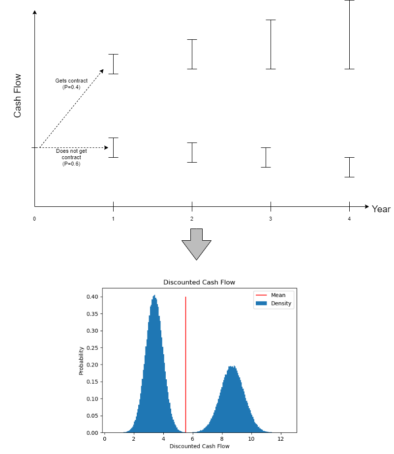

# FutureCashFlow
Discount Cash Flows / Dividends by modelling complex scenarios that explicitly includes risk/uncertainty.
Instead of using simplistic models and model risk with hard-to-calculate discounting rates.

# Install
In base folder, run: 
```
  python setup.py build
  python setup.py install
```


# Example Diagram

Example scenario. See examples/contract_yes_no.py for code


